<!--- CONFIGURATION — Edit these values when forking --->
<!--- GITHUB_USERNAME: ganti dengan username GitHub kamu (untuk stats & snake) --->
<!--- WEBSITE: https://dikaxcloud.web.id --->
<!--- EMAIL: andhikapratamaputra@gmail.com --->
<!--- PROJECT_URLS: lihat di Quest Log --->
<!--- SOCIAL_URLS: hanya isi jika URL sudah terverifikasi --->

<p align="center">
  
</p>

<p align="center">
  <a href="https://dikaxcloud.web.id"></a>
  <a href="mailto:andhikapratamaputra@gmail.com"></a>
  
  
</p>

<p align="center">
  
  
  
  
  
  
</p>

> **“This is a developer portfolio designed like a game.”** — Developer RPG × Cyberpunk HUD × Pixel Art Adventure

---

## 🧭 Table of Contents

- [👤 Player Profile](#-player-profile)
- [📜 Character Lore](#-character-lore)
- [🎯 Current Mission](#-current-mission)
- [âš” Quest Log (Projects)](#-quest-log-projects)
- [🧠 Skill Tree](#-skill-tree)
- [🎒 Tech Inventory](#-tech-inventory)
- [🎓 University Arc](#-university-arc)
- [📚 Education Timeline](#-education-timeline)
- [🏰 Career Quests](#-career-quests)
- [🎓 Training Arc](#-training-arc)
- [💻 Coding Camp Arc](#-coding-camp-arc)
- [🏆 Certification Wall](#-certification-wall)
- [🏠 Homelab Quest](#-homelab-quest)
- [💻 Terminal Mode](#-terminal-mode)
- [📊 Guild Statistics](#-guild-statistics)
- [🐍 Contribution Snake](#-contribution-snake)
- [🏆 Achievement System](#-achievement-system)
- [🔒 Future Quest](#-future-quest)
- [🏆 Final Boss](#-final-boss)

---

## 👤 Player Profile

<p align="center">
  
</p>

<table>
<tr>
<td width="50%" valign="top">

**ANDHIKA PRATAMA PUTRA** — *Cirebon, Jawa Barat*

> *Bachelor of Informatics Student @ Universitas Mercu Buana*  
> *Graduate of SMK Informatika Al-Irsyad — TKJ (Computer & Network Engineering), May 2026*

**Professional Identity**
- ⚔ **FULLSTACK DEVELOPER** — *Building*
- ☁ **CLOUD ENTHUSIAST** — *Exploring*
- 🌐 **NETWORK ENGINEER** — *Experience*
- 🤖 **AI EXPLORER** — *Learning*
- 🐳 **DEVOPS BUILDER** — *Homelab & Docker*
- 🛡 **CYBERSECURITY ENTHUSIAST** — *Learning*

</td>
<td width="50%" valign="top">

**Player Progression** — *visual only, not skill ratings*

```
âš” SOFTWARE DEVELOPMENT
██████████████░░░░  Learning • Building

☁ CLOUD
██████████░░░░░░░░  Exploring • AWS/Azure/GCP

🌐 NETWORKING
███████████████░░░  Experience • MTCNA • NOC

🤖 AI
████████░░░░░░░░░░  Exploring • Gemini API

🛡 SECURITY
████████░░░░░░░░░░  Learning • Pentest basics
```

> *RPG progression bars are visual representations, not skill ratings.*

**Status:** `LVL 07 — NEW ADVENTURER` • `EXP 70%` • `HP 100/100` • `FOCUS 90/100`

</td>
</tr>
</table>

---

## 📜 Character Lore

> **Started from Computer & Network Engineering.**
>
> Learned to understand networks, servers, infrastructure, and troubleshooting.
>
> Then entered the world of software development — building applications with **React, Laravel, and Node.js**.
>
> The adventure expanded into **☁ Cloud Computing • 🤖 AI • 🛡 Cybersecurity • 🐳 DevOps • 🌐 Networking**
>
> Now a new chapter begins:
>
> ### 🎓 UNIVERSITY ARC — Universitas Mercu Buana — Bachelor of Informatics — *August 2026 — Present*

**Current objective:** `BUILD • LEARN • EXPERIMENT • DEPLOY`

**Signature trait:** Actively runs a **personal homelab using Docker** to self-host web applications and securely expose them through **Cloudflare Tunnel** — without port-forwarding. Always learning, always building, always exploring.

<details>
<summary>📖 Full Lore (CV-based)</summary>

- SMK TKJ background — strong foundation in TCP/IP, MikroTik, network troubleshooting.
- Real-world technical experience as **Field Technician** and **NOC Defender** at PT. Internet Keluarga.
- Built 5 production-leaning quests (AI monitoring, ISP NOC system, DarahKita social impact, WebFinance AI, WebCraft SaaS).
- Homelab enthusiast — Docker, Nginx, Cloudflare Tunnel, Telegram alerting.
- Cloud: AWS, Azure, Google Cloud — *exploring & learning*.
- Cybersecurity & AI — ethical hacking, web app security, Gemini API, generative AI — *learning*.

</details>

---

## 🎯 Current Mission

```text
╔════════════════════════════════════════╗
║ 🎯 CURRENT MISSION                     ║
â•‘                                        â•‘
║ 🎓 UNIVERSITY ARC                      ║
â•‘                                        â•‘
â•‘ Continue learning.                     â•‘
â•‘ Build real-world projects.             â•‘
â•‘ Explore cloud infrastructure.          â•‘
â•‘ Experiment with AI.                    â•‘
â•‘ Improve software engineering skills.   â•‘
â•‘                                        â•‘
║ STATUS: 🟢 IN PROGRESS                 ║
╚════════════════════════════════════════╝
```

**Next adventure:** `??? — LOCKED` — To be discovered after University Arc milestones.

---

## âš” Quest Log (Projects)

<p align="center">
  
</p>

### 01 — 🤖 AI Container Monitoring Agent
**Website:** [`dik-ai-agent.web.id`](https://dik-ai-agent.web.id) • **Status:** 🟢 COMPLETED / ACTIVE

AI-assisted container monitoring and alerting system — Telegram Bot + Gemini CLI + Docker + container health monitoring + alerting. Runs inside homelab via Cloudflare Tunnel.

| Stack | `Python` `Docker` `Telegram` `Gemini CLI` |
|-------|--------------------------------------------|

---

### 02 — 🌐 ISP Complaint System — *Enterprise NOC Monitoring*
**Website:** [`internet-stabil.web.id`](https://internet-stabil.web.id) • **Status:** 🟢 COMPLETED

> 🏰 **NOC INFRASTRUCTURE QUEST** — Visually connected to network engineering background.

Enterprise NOC monitoring complaint system — Laravel 11 • React SPA • PostgreSQL • Redis • Docker • Cloudflare Tunnel • Telegram bot monitoring.

| Stack | `Laravel 11` `React SPA` `PostgreSQL` `Redis` `Docker` `Cloudflare Tunnel` |

---

### 03 — ❤ DarahKita — *Coding Camp Capstone* — 🏆 TEAM LEADER QUEST
**Website:** [`darahkita.web.id`](https://darahkita.web.id) • **Role:** **TEAM LEADER** • **Status:** 🟢 COMPLETED

Full-stack social-impact application connecting blood donors with people in need. As Team Leader: team coordination, timeline management, task distribution, ensuring technical delivery & social-impact goals.

| Stack | `Full-Stack` `Social Impact` `Team Leadership` | `Jan — Apr 2026` |

---

### 04 — 💰 WebFinance — *AI Personal Finance Manager* — 🤖 AI AUTOMATION QUEST
**Website:** [`moneyku-telegram.web.id`](https://moneyku-telegram.web.id) • **Status:** 🟢 COMPLETED

Telegram bot expense tracking with AI categorization. Automates financial logging via AI.

| Features | `Telegram Bot` `Expense Tracking` `AI Categorization` |

---

### 05 — 🏪 WebCraft — *Website & POS System Development Service* — 🏪 SAAS BUILDER QUEST
**Website:** [`contoh-web-jualan.my.id`](https://contoh-web-jualan.my.id) • **Status:** 🔵 ACTIVE

Multi-tenant SaaS for web/POS development services.

| Stack | `Laravel` `SaaS` `POS` `Multi-tenant` |

---

## 🧠 Skill Tree

<p align="center">
  
</p>

```
                    🧠
             SOFTWARE ENGINEERING
                       │
        ┌──────────────┼──────────────┐
        ↓              ↓              ↓
    ⚔ WEB          ☁ CLOUD        🌐 NETWORK
        │              │              │
        ↓              ↓              ↓
     DEVOPS          AI          SECURITY
```

### âš” Web Development
`React.js` `JavaScript` `Node.js` `Laravel` `HTML` `CSS` — *Building • Familiar*

### ☁ Cloud
`AWS` `Microsoft Azure` `Google Cloud` — *Exploring • Learning*

### 🐳 DevOps
`Docker` `Nginx` `Cloudflare Tunnel` — *Homelab • Self-hosted*

### 🗄 Database
`MySQL` `PostgreSQL — Learning` `Redis`

### 🌐 Network
`TCP/IP` `MikroTik` `NOC Monitoring` `Network Troubleshooting` — *Experience*

### 🛡 Cybersecurity
`Ethical Hacking` `Web Application Security` `Penetration Testing fundamentals` — *Learning*

### 🤖 AI
`Gemini API` `Generative AI` `AI-assisted development` — *Exploring*

> All terminology uses exact CV wording. “Learning / Exploring / Familiar” preserved — not upgraded to “expert”.

---

## 🎒 Tech Inventory

| Category | Items |
|----------|-------|
| **âš” WEAPONS (Code)** |     |
| **🛡 ARMOR (Infra)** |    |
| **☁ ARTIFACTS (Cloud)** |    |
| **🤖 POTIONS (AI)** |    |
| **🗄 STORAGE (Data)** |    |

---

## 🎓 University Arc

<p align="center">
  
</p>

```text
┌───────────────────────────────────────────────┐
│ 🎓 UNIVERSITY ARC                             │
│                                               │
│ UNIVERSITAS MERCU BUANA                       │
│ Bachelor of Informatics                       │
│                                               │
│ AUGUST 2026 — PRESENT                         │
│                                               │
│ STATUS: 🟢 QUEST IN PROGRESS                  │
│                                               │
│ "The next chapter has begun."                 │
└───────────────────────────────────────────────┘
```

> Do **NOT** invent GPA, semester, student organization, or university achievements. This is a newly started chapter — *New Adventure*.

**Visual narrative:**
```
SMK TKJ → NETWORK & TECHNICIAN → NOC EXPERIENCE → FULLSTACK DEVELOPMENT → CLOUD + AI + CYBERSECURITY → 🎓 UNIVERSITY ARC → ??? NEXT ADVENTURE
```

---

## 📚 Education Timeline

```
2026
│
├── 🎓 SMK TKJ — SMK Informatika Al-Irsyad Al-Islamiyyah
│   TKJ (Computer & Network Engineering) — Graduated May 2026
│
├── 💻 Coding Camp — Dicoding
│   Jan — Apr 2026 — Full-Stack Web Developer
│
├── ☁ AWS re/Start — Orbit Future Academy
│   Aug — Sep 2026 — 🟡 IN PROGRESS
│
└── 🎓 UNIVERSITAS MERCU BUANA
    Bachelor of Informatics — Aug 2026 — Present — 🟢 IN PROGRESS
```

---

## 🏰 Career Quests

### 🏰 NOC Defender — *PT. Internet Keluarga — Oct 2025 — Dec 2025*

Real-time network monitoring • Server infrastructure monitoring • Incident documentation • Activity logs • Daily performance reports • Troubleshooting • Escalation to relevant teams.

### 🔧 Field Technician — *PT. Internet Keluarga — Jul 2025 — Sep 2025*

On-site technical support • Network device installation & configuration & maintenance • Router / Access Point / Modem • Cable infrastructure inspection • Connectivity troubleshooting • NOC coordination • Customer interaction.

---

## 🎓 Training Arc

### Orbit Future Academy — AWS re/Start Program — `Aug 2026 — Sep 2026` — 🟡 IN PROGRESS

> **Do not mark as completed.**

**Topics:** Linux administration • Python fundamentals • TCP/IP networking • Cybersecurity fundamentals • SQL • AWS Management Console • AWS CLI • Amazon EC2 • Amazon VPC • Elastic Load Balancing • Auto Scaling • Amazon CloudWatch • Containers • Monitoring • Agile collaboration

---

## 💻 Coding Camp Arc

### Dicoding — Coding Camp — `Jan 2026 — Apr 2026`

**Topics:** HTML • CSS • JavaScript • React • Node.js • REST API • Authentication • Database integration • Git • GitHub • Clean code • Component-based architecture • Spec-driven development

**Special Achievement:** 🏆 **TEAM LEADER — DarahKita Capstone** — Team coordination, timeline management, task distribution, technical delivery & social-impact goals.

---

## 🏆 Certification Wall

<details open>
<summary><b>☁ Cloud & AWS (3)</b></summary>

- Belajar Dasar Cloud dan Gen AI di AWS — Dicoding
- Belajar Penerapan Data Science dengan Microsoft Fabric & Gen AI Azure — Dicoding
- Cloud Computing LKS SMK — Dinas Pendidikan Jabar

</details>

<details open>
<summary><b>🛡 Cybersecurity & Network (8)</b></summary>

- MTCNA — MikroTik
- Olimpiade Jaringan MikroTik 2024 — Citraweb
- Ethical Hacker — Cisco
- Certified Junior Web App Penetration Tester — Sturtle Security
- CCEP — Red Team Leaders
- CRTOM — Red Team Leaders
- CTIGA — Red Team Leaders
- CRPO — Certified Ransomware Protection Officer

</details>

<details open>
<summary><b>âš” Web Development (6)</b></summary>

- Coding Camp 2026 Full-Stack Web Developer — Dicoding
- Belajar Back-End Pemula dengan JavaScript — Dicoding
- Belajar Dasar Pemrograman Web — Dicoding
- Belajar Membuat Aplikasi Web dengan React — Dicoding
- Spec-Driven Development dengan Kiro — Dicoding
- Memulai Dasar Pemrograman untuk Menjadi Pengembang Software — Dicoding

</details>

<details open>
<summary><b>🤖 AI & Productivity (5)</b></summary>

- AI Mini Camp — AI & Digital Productivity
- AI Praktis untuk Produktivitas — Dicoding
- Belajar Penggunaan Generative AI — Dicoding
- Productivity with AI Bootcamp — Kementerian Ekonomi Kreatif
- Introduction to Financial Literacy — Dicoding

</details>

> No certificate numbers or dates invented — names only as per CV.

---

## 🏠 Homelab Quest

<p align="center">
  
</p>

```
                 ☁ INTERNET
                      │
                      â–¼
             CLOUDFLARE TUNNEL
                      │
                      â–¼
                 🏠 HOMELAB
                      │
                 🐳 DOCKER
                      │
       ┌──────────────┼──────────────┐
       ↓              ↓              ↓
    WEB APPS       🤖 AI AGENT    MONITORING
       │              │              │
       └──────────────┼──────────────┘
                      ↓
                 📱 TELEGRAM
```

**Tech:** `Docker` `Self-hosted web applications` `Cloudflare Tunnel` `AI monitoring` `Telegram alerting` — *No hardware specs invented.*

**Live endpoints:**
`dik-ai-agent.web.id` • `internet-stabil.web.id` • `darahkita.web.id` • `moneyku-telegram.web.id` • `contoh-web-jualan.my.id`

---

## 💻 Terminal Mode

<p align="center">
  
</p>

```bash
┌──[andhika@homelab]─[~]
$ whoami

Fullstack Developer
Cloud Enthusiast
Network Engineer
Informatics Student

$ current_arc

University Arc

$ interests

Software Development
Cloud Computing
Networking
Cybersecurity
AI
DevOps

$ current_mission

Build.
Learn.
Experiment.
Deploy.

$ â–ˆ
```

---

## 📊 Guild Statistics

> *Never hardcode fake statistics — these are dynamic. Replace `dikaxcloud` in URLs below if forking.*

<p align="center">
  <a href="https://github.com/dikaxcloud">
    
  </a>
  <a href="https://github.com/dikaxcloud">
    
  </a>
</p>

<p align="center">
  
</p>

<p align="center">
  
</p>

<details>
<summary>⚙ Configuration — How to enable stats</summary>

1. Ganti `dikaxcloud` di README ini dengan username GitHub kamu (3 tempat).
2. Ganti `dikaxcloud` di `.github/workflows/snake.yml`.
3. Commit & push — stats akan muncul otomatis.
4. Jika service down, placeholder tetap menunjukkan layout tanpa angka palsu.

</details>

---

## 🐍 Contribution Snake

<p align="center">
  
</p>

> Snake animation generated via **GitHub Actions** (`.github/workflows/snake.yml`). Style fits RPG/cyberpunk theme. Doesn't dominate README.

If you see a broken image, run the workflow manually: **Actions → Generate Snake → Run workflow**.

---

## 🏆 Achievement System

| Achievement | Unlock Condition |
|-------------|------------------|
| 🏆 **FULLSTACK BUILDER** | 5 full-stack quests — React, Laravel, Node.js, PostgreSQL, Redis |
| 🏆 **NOC DEFENDER** | Real-time network & server monitoring — PT. Internet Keluarga |
| 🏆 **NETWORK WARRIOR** | TKJ background + MTCNA + MikroTik Olympiad + troubleshooting |
| 🏆 **CONTAINER TAMER** | Docker + homelab + Cloudflare Tunnel — self-host enthusiast |
| 🏆 **CLOUD EXPLORER** | AWS / Azure / Google Cloud — learning & building |
| 🏆 **AI EXPLORER** | Gemini CLI + Telegram bots + AI categorization |
| 🏆 **TEAM LEADER** | DarahKita Capstone — led team to delivery |
| 🏆 **UNIVERSITY ARC UNLOCKED** | Bachelor of Informatics @ Universitas Mercu Buana — Aug 2026 |
| 🏆 **SECURITY APPRENTICE** | Ethical Hacker (Cisco), CCEP, CRTOM, CTIGA, CRPO — cybersecurity path |

---

## 🔒 Future Quest

```text
🔒 FUTURE QUEST

??? — LOCKED

Requirements:

☐ Keep learning
☐ Build more
☐ Explore new technologies
☐ Complete University Arc

Status:

LOCKED

"To be discovered..."
```

> Intentionally fictional / game-themed — does **not** claim a real future project.

---

## 🏆 Final Boss

<p align="center">
  
</p>

```
╔══════════════════════════════════════════╗
║                🏆 FINAL BOSS             ║
â•‘                                          â•‘
â•‘        BUILD SOMETHING GREAT             â•‘
â•‘                                          â•‘
â•‘       Let's build the next quest.       â•‘
â•‘                                          â•‘
║  🌐 dikaxcloud.web.id                    ║
║  📧 andhikapratamaputra@gmail.com        ║
║  🐙 GitHub (configure in workflow)       ║
║  💼 LinkedIn (add your verified link)    ║
╚══════════════════════════════════════════╝
```

**Contact — verified only:**
- 🌐 Website: [`https://dikaxcloud.web.id`](https://dikaxcloud.web.id)
- 📧 Email: [`andhikapratamaputra@gmail.com`](mailto:andhikapratamaputra@gmail.com)
- 🐙 GitHub: *ganti `dikaxcloud` di README & workflow*
- 💼 LinkedIn: *(add your verified link — never invented)*

---

### 🥚 Easter Eggs

```text
🐛 CURRENT BUG

Status:

Probably a feature.
```

```text
> sudo unlock_secret

ACCESS DENIED

Nice try, adventurer.
```

```text
🏆 SECRET ACHIEVEMENT

You actually read the entire README.

Curious Developer Unlocked!
```

---

<p align="center">
  <sub>Built with ◉ Markdown + SVG + GitHub Actions • No JavaScript • No heavy GIFs • Optimized for mobile • Dark Cyberpunk RPG + Pixel Art + Developer HUD</sub><br/>
  <sub>Data accuracy verified: SMK TKJ May 2026 • Univ Mercu Buana Aug 2026–Present • Technician Jul–Sep 2025 • NOC Oct–Dec 2025 • AWS re/Start Aug–Sep 2026 (IN PROGRESS) • 5 Quests as listed</sub>
</p>

<p align="center">
  
</p>
