<!--- ANDHIKA PRATAMA PUTRA — NEAT RPG DASHBOARD — VECTOR PREMIUM --->

  

  
  
  
  

<!-- Row — Player | About | Mission — clean 3-column -->
<table>
<tr>
<td width="33%" valign="top">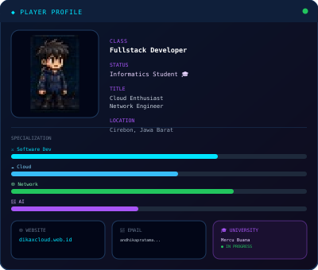</td>
<td width="34%" valign="top">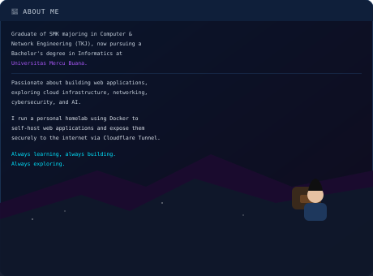</td>
<td width="33%" valign="top">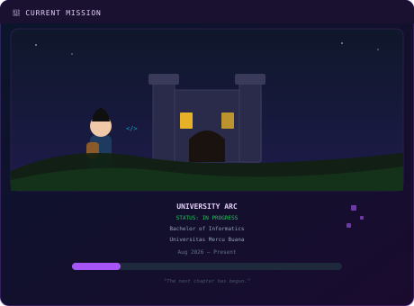</td>
</tr>
</table>

<!-- Quest Log — neat 5 cards -->

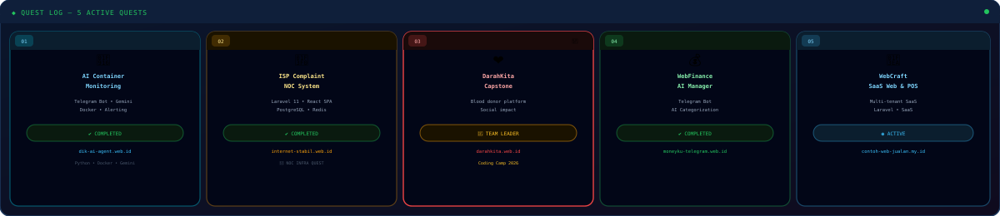

<!-- Skill Tree — full width premium -->

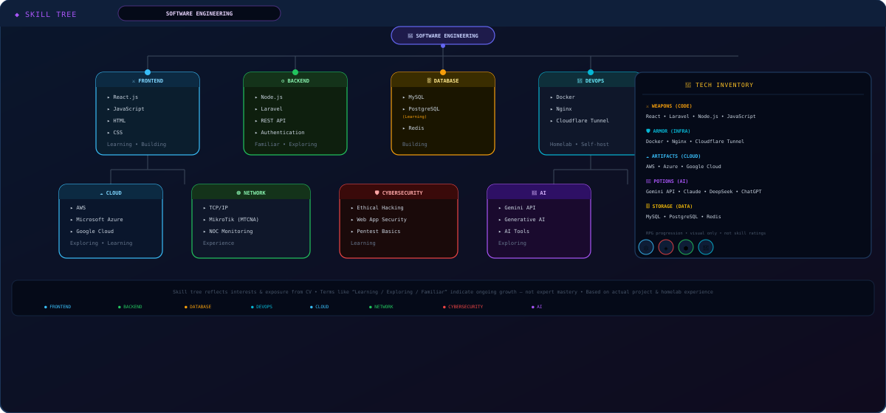

<!-- Journey + Education -->
<table>
<tr>
<td width="65%" valign="top">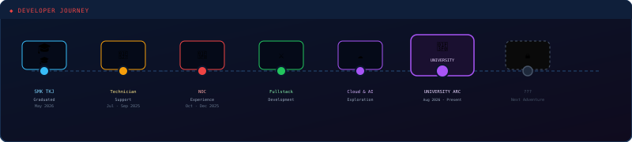</td>
<td width="35%" valign="top">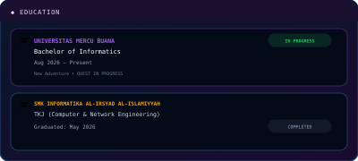</td>
</tr>
</table>

<!-- Career + Training + Achievements -->
<table>
<tr>
<td width="33%" valign="top">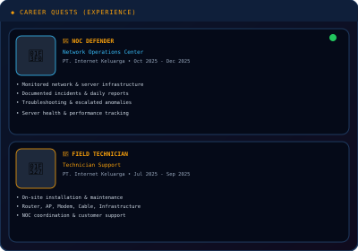</td>
<td width="33%" valign="top">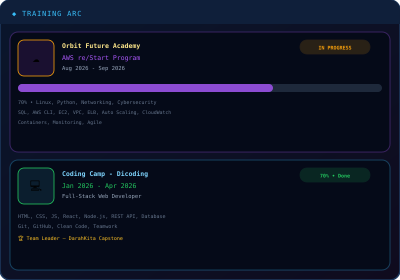</td>
<td width="34%" valign="top">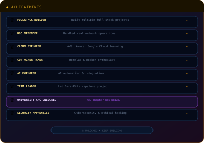</td>
</tr>
</table>

<!-- Certification — full width -->

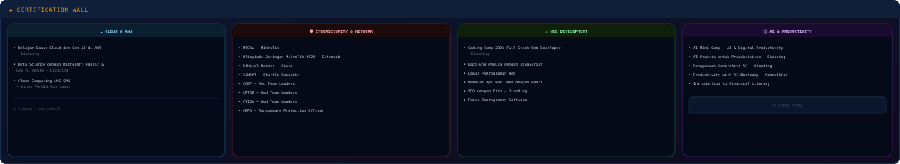

<!-- Homelab -->

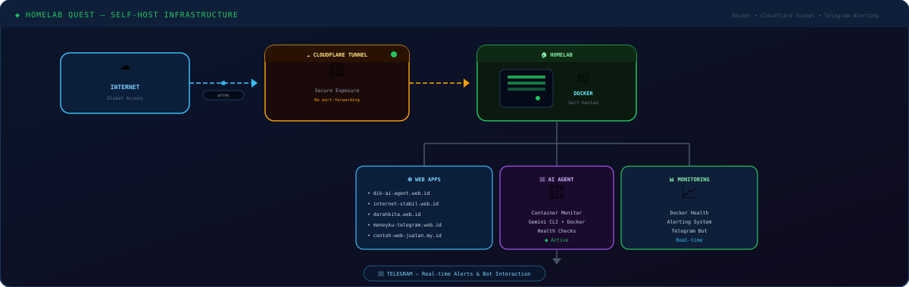

<!-- Terminal + Stats -->
<table>
<tr>
<td width="50%" valign="top">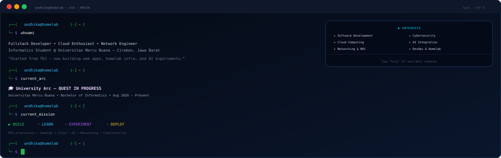</td>
<td width="50%" valign="top">
  
  
  
</td>
</tr>
</table>

<!-- Final Boss -->

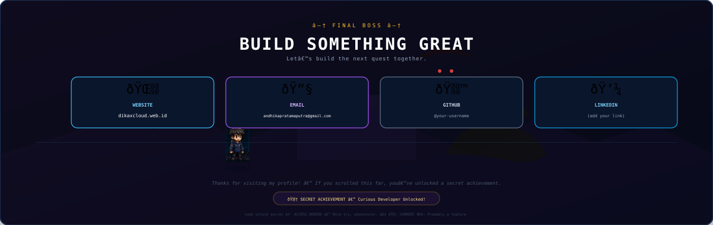

Neat RPG Dashboard — vector premium — konsisten padding 12px, border 1.5px, radius 12, cyan/purple/green/amber — animasi halus (blink, pulse, progress) — sama tema kayak ref.png tapi lebih rapih & premium

📄 Text fallback untuk recruiter

Andhika Pratama Putra — Fullstack Developer • Cloud Enthusiast • Network Engineer — Cirebon — dikaxcloud.web.id — Universitas Mercu Buana Bachelor Informatics Aug 2026 Present — SMK TKJ May 2026 — PT Internet Keluarga NOC Oct-Dec 2025 Technician Jul-Sep 2025 — Quests: dik-ai-agent.web.id, internet-stabil.web.id, darahkita.web.id (Team Leader), moneyku-telegram.web.id, contoh-web-jualan.my.id — Homelab Docker Cloudflare Tunnel — 22 certs

