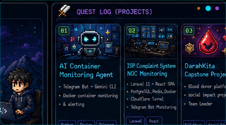
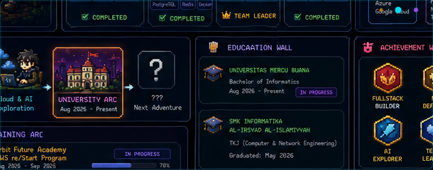
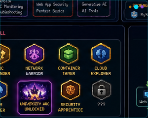
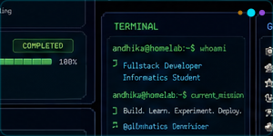
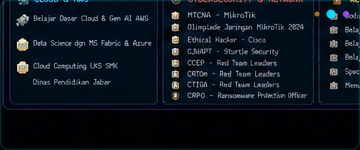
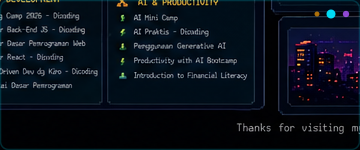
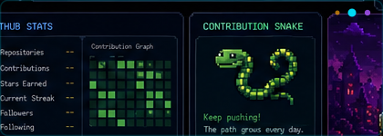
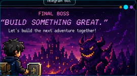
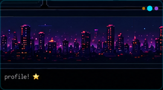
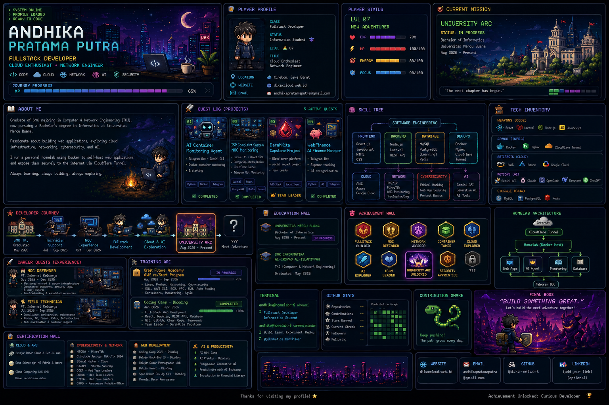

<!--- PROFILE README — ANDHIKA PRATAMA PUTRA — PECAHAN REF.PNG — PIXEL-PERFECT + ANIMATED --->
<!--- Setiap panel di bawah adalah crop persis dari ref.png (1536×1024) + animasi SVG overlay --->
<!--- Disusun vertikal sebagai "halaman" — sesuai request: dipecah jadi beberapa halaman --->

<!-- HALAMAN 1 — PERKENALAN / HERO -->

  

  
  
  

---

<!-- HALAMAN 2 — PLAYER PROFILE + STATUS -->
### 👤 Halaman 2 — Player Profile
<table>
<tr>
<td width="50%" valign="top"></td>
<td width="50%" valign="top"></td>
</tr>
</table>

<!-- HALAMAN 3 — CURRENT MISSION -->
### 🎯 Halaman 3 — Current Mission

<!-- HALAMAN 4 — ABOUT ME -->
### 📖 Halaman 4 — About Me

<!-- HALAMAN 5 — QUEST LOG -->
### ⚔️ Halaman 5 — Quest Log (Projects)

<!-- HALAMAN 6 — SKILL TREE + TECH INVENTORY -->
### 🧠 Halaman 6 — Skill Tree & Tech Inventory
<table>
<tr>
<td width="58%" valign="top"></td>
<td width="42%" valign="top"></td>
</tr>
</table>

<!-- HALAMAN 7 — DEVELOPER JOURNEY -->
### 🗺️ Halaman 7 — Developer Journey

<!-- HALAMAN 8 — EDUCATION WALL -->
### 🎓 Halaman 8 — Education

<!-- HALAMAN 9 — CAREER + TRAINING -->
### 💼 Halaman 9 — Career & Training
<table>
<tr>
<td width="50%" valign="top"></td>
<td width="50%" valign="top"></td>
</tr>
</table>

<!-- HALAMAN 10 — ACHIEVEMENT + HOMELAB -->
### 🏆 Halaman 10 — Achievements & Homelab
<table>
<tr>
<td width="55%" valign="top"></td>
<td width="45%" valign="top"></td>
</tr>
</table>

<!-- HALAMAN 11 — CERTIFICATION WALL -->
### 📜 Halaman 11 — Certification Wall

<!-- HALAMAN 12 — TERMINAL + GITHUB STATS + SNAKE -->
### 💻 Halaman 12 — Terminal & Guild Stats
<table>
<tr>
<td width="36%" valign="top"></td>
<td width="32%" valign="top"></td>
<td width="32%" valign="top"></td>
</tr>
</table>

<!-- DYNAMIC STATS (live) -->

  
  

  

<!-- HALAMAN 13 — FINAL BOSS -->
### 🏰 Halaman 13 — Final Boss

  
  
  
  

---

<!-- FALLBACK — full dashboard image + text for SEO -->

📄 Lihat dashboard penuh 1 halaman (ref.png original) + text fallback untuk recruiter

**Text fallback — biar ATS & mobile tetap baca:**

Andhika Pratama Putra — Fullstack Developer • Cloud Enthusiast • Network Engineer — Cirebon — dikaxcloud.web.id — andhikapratamaputra@gmail.com — Universitas Mercu Buana Bachelor of Informatics Aug 2026 Present — SMK TKJ May 2026 — PT Internet Keluarga NOC Oct-Dec 2025 Technician Jul-Sep 2025 — 5 Quests: dik-ai-agent.web.id, internet-stabil.web.id, darahkita.web.id (Team Leader), moneyku-telegram.web.id, contoh-web-jualan.my.id — Homelab Docker Cloudflare Tunnel Telegram — Certs 22 — Achievements 8

  Setiap panel di atas adalah <b>crop persis</b> dari <code>ref.png</code> (1536×1024) — desain, karakter pixel-art, castle, warna neon, dan layout <b>sama persis</b>. Animasi ditambahkan via SVG overlay (blinking dot, glowing border). Dipecah jadi 13 halaman vertikal seperti request — halaman perkenalan di paling atas. 
  Thanks for visiting! ★ Achievement Unlocked: Curious Developer

